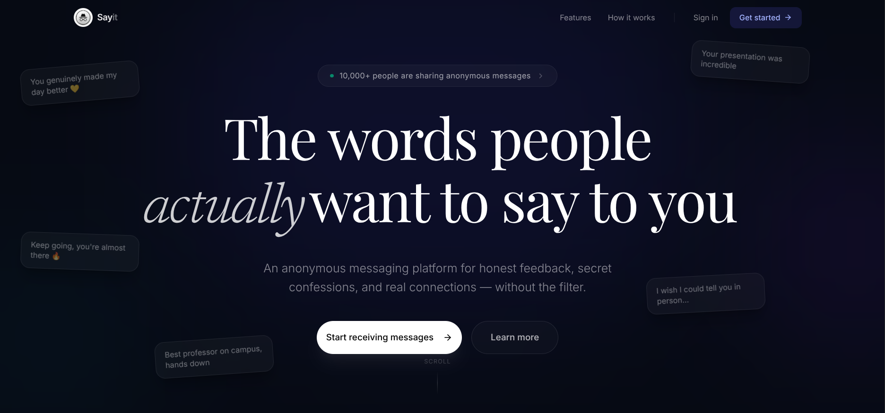

# Sayit

An anonymous messaging platform built with Next.js, MongoDB, NextAuth, and Resend. Users can create an account, verify their email, share a public profile link, and receive anonymous messages through a clean dashboard experience.

## Landing Page Screenshot




## Overview

Sayit is designed around a simple flow: a visitor signs up, verifies the account through email, signs in, copies a unique profile link, and starts receiving anonymous messages. The public profile page is open for submissions, while the dashboard stays behind authentication for message management and message acceptance settings.

## Features

- Email-based account verification with a one-time code.
- Credentials authentication powered by NextAuth.
- Unique public profile links in the format `/u/[username]`.
- Anonymous message submission from the public profile page.
- Private dashboard for viewing, refreshing, and deleting messages.
- Toggle to accept or stop receiving new anonymous messages.
- Username availability checks during sign-up.
- Resend-powered verification emails.

## How It Works

```text
┌─────────┐
│ Visitor │
└────┬────┘
     │
     ▼
┌──────────────────────────────────────────────────┐
│ Sign Up -> Email Verification Code -> Sign In    │
└────────────────────┬─────────────────────────────┘
                     │
                     ▼
┌──────────────────────────────────────────────────┐
│ Dashboard -> Copy Public Link -> Share Profile   │
└────────────────────┬─────────────────────────────┘
                     │
                     ▼
┌──────────────────────────────────────────────────┐
│ Public Profile Page -> Anonymous Message Submission │
└────────────────────┬─────────────────────────────┘
                     │
                     ▼
┌──────────────────────────────────────────────────┐
│ Database Stores Message -> Dashboard Refreshes   │
└──────────────────────────────────────────────────┘
```

## Tech Stack

- Next.js 15 with the App Router
- React 19
- TypeScript
- MongoDB with Mongoose
- NextAuth for authentication
- Resend for transactional email delivery
- React Hook Form and Zod for form validation
- Tailwind CSS and shadcn/ui-style components
- Sonner for notifications

## Project Structure

```text
src/
	app/
		(app)/
			page.tsx
			dashboard/page.tsx
		(auth)/
			sign-in/page.tsx
			sign-up/page.tsx
			verify/[username]/page.tsx
		u/[username]/page.tsx
		api/
			sign-up/route.ts
			verify-code/route.ts
			check-username-unique/route.ts
			send-message/route.ts
			get-messages/route.ts
			accept-messages/route.ts
			delete-messages/[id]/route.tsx
	components/
	helpers/
	lib/
	model/
	schemas/
	types/
emails/
public/
```

## Getting Started

### Prerequisites

- Node.js 18 or newer
- MongoDB database
- Resend account and API key
- NextAuth secret

### Install Dependencies

```bash
npm install
```

### Configure Environment Variables

Create a `.env.local` file in the project root and set the required values:

```bash
MONGODB_URI=
NEXTAUTH_SECRET=
NEXT_PUBLIC_BASE_URL=http://localhost:3000
RESEND_API_KEY=
```

If you use a different host in development or production, update `NEXT_PUBLIC_BASE_URL` accordingly so the dashboard can build the correct public profile link.

### Run Locally

```bash
npm run dev
```

Then open http://localhost:3000.

## Available Scripts

- `npm run dev` starts the local development server.
- `npm run build` creates a production build.
- `npm run start` runs the production server.
- `npm run lint` runs lint checks.

## Authentication and Message Flow

```text
1. User signs up with username, email, and password.
2. Server checks whether the username is already taken.
3. If the user is new, the app hashes the password and sends a verification code.
4. User enters the code on the verification page.
5. After verification, the user signs in with credentials.
6. The dashboard loads the public profile link and stored messages.
7. Visitors open /u/[username] and send anonymous messages.
8. The owner can switch message acceptance on or off at any time.
```

## API Endpoints

- `POST /api/sign-up` creates a new account and sends a verification email.
- `POST /api/verify-code` verifies the account using the emailed code.
- `GET /api/check-username-unique?username=...` checks whether a username is available.
- `POST /api/send-message` stores an anonymous message for a user.
- `GET /api/get-messages` returns the authenticated user’s messages.
- `GET /api/accept-messages` reads the current message acceptance setting.
- `POST /api/accept-messages` updates the message acceptance setting.
- `DELETE /api/delete-messages/[id]` removes a message from the dashboard.

## Notes

- The public profile route is `/u/[username]`.
- The dashboard is protected and redirects unauthenticated users to sign in.
- New users must verify their email before credentials sign-in is allowed.
- The verification code expires after one hour.

## Deployment

This project is ready to deploy as a standard Next.js application. Make sure the production environment includes the same variables used locally, especially `MONGODB_URI`, `NEXTAUTH_SECRET`, `NEXT_PUBLIC_BASE_URL`, and `RESEND_API_KEY`.


